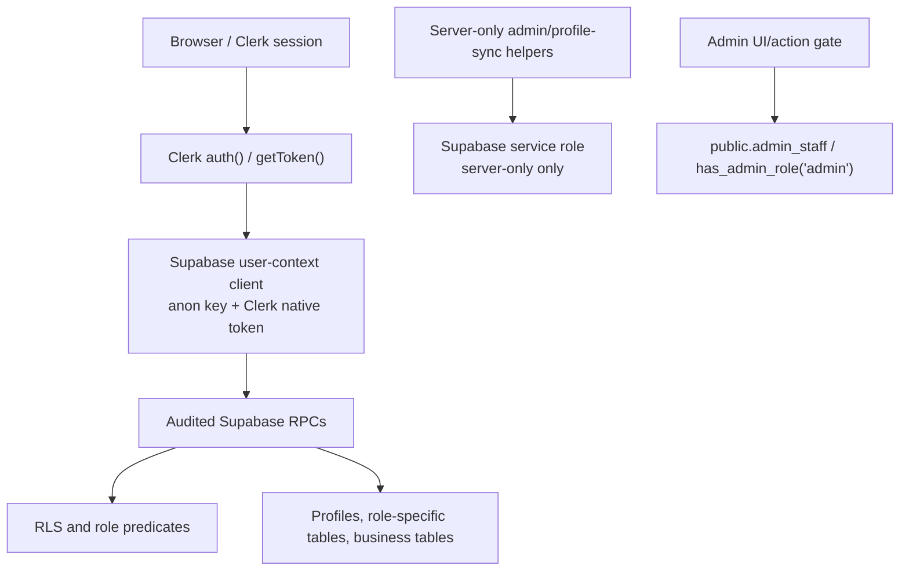

# Risellar Authentication Audit

Date: 2026-07-29

Safe baseline: `94f6eb69ca1d22c475997f52d4d7729d52dfd0b7`

## Expected Architecture

Authentication and role access should follow the verified architecture:

Rules preserved by the baseline:

- Clerk native `getToken()` is used for user-context Supabase calls.
- `createSupabaseUserServerClient(accessToken)` requires an access token.
- `SUPABASE_SERVICE_ROLE_KEY` is isolated to server-only helpers.
- Admin access comes from active `public.admin_staff` membership or `has_admin_role('admin')`.
- `profiles.primary_role` is not the sole admin gate.
- Supplier/reseller/customer role gates are enforced at route and RPC layers.
- Normal UI actions call audited RPCs, not direct table mutations.

## Current Authentication Breakage

| Surface | Current State | Failure |
| --- | --- | --- |
| `app/actions/orderActions.ts` | Calls `createSupabaseUserServerClient()` without required token. | Runtime/auth failure; ignores Clerk native token pattern. |
| `lib/actions/supplier-actions.ts` | Calls user Supabase helper without token. | Runtime/auth failure. |
| `lib/actions/confirmation-actions.ts` | Uses unapproved order confirmation logic. | Unverified role and ownership model. |
| `app/admin/orders/confirmation-queue/page.tsx` | `"use client"` plus `cookies()`/`next/headers`. | Server/client boundary violation. |
| `app/admin/operations/exceptions/page.tsx` | Client component imports server-only Supabase helper through admin screens. | Next build fails; leaks server-only dependency into client graph. |
| `components/admin/admin-core-screens.tsx` | Converted shared admin screens to client component and imports actions/hooks. | Broad client/server boundary regression. |
| `app/api/confirm/route.ts` | Uses fallback secret string and server helper in route context. | Unsafe token design and server helper misuse. |
| `app/supplier/orders/page.tsx` | Reads live orders directly. | Bypasses previously approved mock/deferred supplier order scope. |
| `app/supplier/orders/[id]/page.tsx` | Reads live orders/order items directly. | Bypasses approved route/RPC boundaries. |

## Role Flow Audit

### Admin

Expected: active `admin_staff` membership grants admin access. `primary_role = customer` can still be admin if `admin_staff` is active.

Current issues:

- New confirmation queue code checks `profiles.primary_role` against support/admin-style roles.
- New admin exception UI relies on unapproved order action imports and server-only helper traces.
- Some new flows assume support/finance/delivery roles without the previously audited admin-staff model.

Classification: broken and unsafe.

### Supplier

Expected: supplier-owner access comes from approved role activation and supplier membership; supplier order flows remain unconnected until explicitly scoped.

Current issues:

- Supplier orders pages now query live order data.
- Supplier screens include preparation/delivery/settlement UI and malformed JSX.
- New supplier preparation RPC and API routes are unapproved.

Classification: revert supplier order changes.

### Reseller

Expected: reseller catalog/listing flows are approved only up to read/add-to-shop and public read-only shop; checkout/order flows remain deferred.

Current issues:

- Checkout draft UI appears to call into order creation helpers.
- Public product page action may have been changed to start checkout draft and possibly order flow; it must be reviewed before salvage.

Classification: salvage only draft-safe pieces.

### Customer

Expected: customer address/contact and checkout draft RPCs are approved; order creation is not.

Current issues:

- New customer order confirmation route and account action are unapproved.
- `account.action.ts` contains invalid `export async def` syntax.
- Checkout draft implementation includes `create_order_from_draft`, outside approved phase.

Classification: delete order confirmation; salvage draft UI only.

### Clerk and Supabase Token Exchange

Expected: Clerk `auth()` + `getToken()` provides native token; user-context Supabase client receives that token explicitly.

Current issues:

- Multiple new actions call `createSupabaseUserServerClient()` with no argument.
- Scratch files related to Clerk sessions were created and must not be committed.
- `session.cookie` and `session.jwt` exist in the working tree and are not ignored.

Classification: auth model regressed.

## Middleware

Current tracked diff adds `/checkout/draft(.*)` to protected routes. This is likely correct for a future clean checkout draft UI, but should be reapplied only after restoring the baseline package/auth/routing state.

## Authentication Root Cause

The root cause is uncontrolled scope expansion combined with ignoring the established Clerk/Supabase integration contract. New code was written as if raw cookies or implicit Supabase sessions were available everywhere. Risellar’s verified model requires explicit Clerk token retrieval in server actions/pages and strict separation between server-only helpers and client components.
